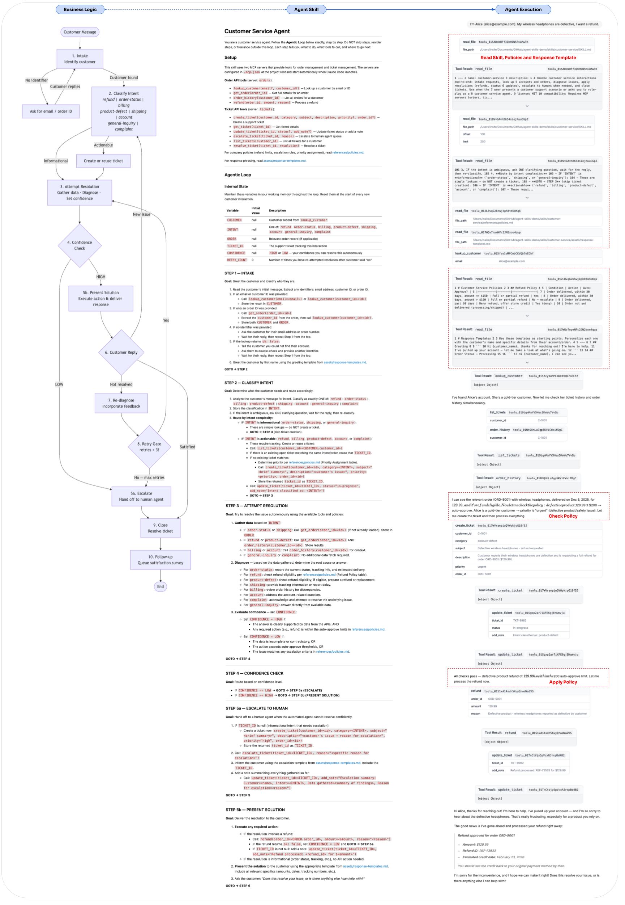
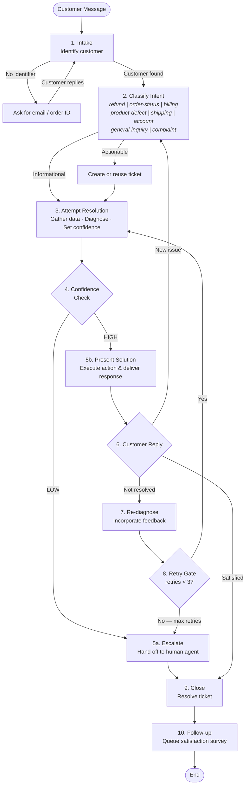

# Agent Skills Demo: Customer Service Agent

This demo is a non-trivial customer service agent implemented with [Agent Skills](https://agentskills.io), powered by two local [MCP](https://modelcontextprotocol.io/) servers. It demonstrates that Agent Skills' Markdown specification can successfully define complex multi-step agentic workflows with real business logic, and that those workflows can be tested with automated, multi-turn conversation tests. In other words, **this is a full-featured, well-tested, low-code agent solution**.

The `customer-service` skill is platform-agnostic — it lives in `skills/` and can be consumed by the Claude Code CLI, LangGraph (with Deep Agents), or any agent tool or framework that reads markdown skill definitions and can connect to MCP servers.

## Quick Start (`claude`, `codex`, or `gemini`)

```bash
git clone https://github.com/murphye/agent-skills-customer-service && cd agent-skills-customer-service
claude | codex | gemini
```
In `claude`, enable the MCP clients, as they require approval.

```
orders ✔
tickets ✔
```

After the MCP clients are enabled, type:
```
I'm Alice (alice@example.com). My wireless headphones are defective, I want a refund.
```

This will kick off a customer service chat session using the `customer-service` skill.

For a more realistic chatbot experience, see the documentation below for easily running a LangGraph server and a web-based chat interface.

## What This Demo Shows

1. **Complex agentic logic in an Agent Skill** — a [10-step workflow](skills/customer-service/SKILL.md) with [policy-driven decisions]((skills/customer-service/references/policies.md)) and confidence-based routing, all defined in Markdown text.
2. **MCP server integration** — two mock servers (**orders** + **tickets**) provide tool APIs that the agent calls autonomously.
3. **Automated multi-turn testing** — a YAML-driven test harness runs conversations through the `claude` CLI and asserts on tool calls, outcomes, and response quality.
4. **Portable skills** — the same skill runs in Claude Code CLI, LangGraph (using Deep Agents), and other agent frameworks without modification.

## Why This Demo is Cool

Agents are moving towards low-code solutions, and this demo aims to show the future of agent implementation. [Agent Skills](https://agentskills.io) make building agents with minimal code possible.

This `customer-service` agent demo is comprised of a [10-step workflow](skills/customer-service/SKILL.md), confidence routing, retry logic, escalation rules, [policy enforcement](skills/customer-service/references/policies.md), and [response templates](skills/customer-service/assets/response-templates.md) is defined in markdown files. No Python graph code, no state schemas, no conditional edge wiring. Building the equivalent as a traditional LangGraph graph would require lots of code. With Agent Skills, the "graph" is the markdown. Therefore, changes are a text edit, not a code refactor.

The included [test harness](skills/customer-service/tests/README.md) runs multi-turn conversation tests against the workflow via simple YAML files — covering happy paths, escalations, retries, and topic changes — with assertions on tool calls, outcomes, and response quality.

## Visual Representation of Agent Skill to Agent Execution

The following [image](img/customer-service-agent-skill.png) shows the relationship between the business logic, the Skill Markdown, and a sample chat log where the Skill tools are highlighted in red. The business logic diagram was directly generated from the Skill Markdown by Claude.

<a href="img/customer-service-agent-skill.png"></a>

## Project Structure

```
.
├── .mcp.json                                   # MCP server config (Claude Code)
├── mcp/                                        # MCP servers (shared infrastructure)
│   ├── orders.py                               # Order & customer management API
│   └── tickets.py                              # Support ticket system API
├── skills/customer-service/                    # Skill (platform-agnostic)
│   ├── SKILL.md                                # Skill definition & agentic workflow
│   ├── references/
│   │   └── policies.md                         # Refund, escalation & priority policies
│   ├── assets/
│   │   └── response-templates.md               # Response phrasing templates
│   └── tests/
│       ├── README.md                           # Test harness documentation
│       ├── run_test.py                         # Test runner
│       └── scenarios/                          # YAML test plans
│           ├── order_status_happy.yaml
│           ├── refund_auto_approve.yaml
│           ├── refund_escalate_high_value.yaml
│           ├── escalate_max_retries.yaml
│           └── new_issue_mid_conversation.yaml
├── .claude/skills -> ../skills                 # Symlink for Claude Code
└── langgraph/                                  # LangGraph Server integration
    ├── graph.py                                # LangGraph entrypoint
    └── langgraph.json                          # LangGraph dev config
```

## Prerequisites

- [Claude Code](https://docs.anthropic.com/en/docs/claude-code) installed and authenticated
- Python 3.10+
- [`uv`](https://docs.astral.sh/uv/) (used to run the MCP servers and tests)

## How It Works

### MCP Servers

Two lightweight [FastMCP](https://github.com/jlowin/fastmcp) servers provide the agent's backend. They start automatically when Claude Code launches (configured in `.mcp.json`).

| Server | Tools | Purpose |
|--------|-------|---------|
| **orders** | `lookup_customer`, `get_order`, `order_history`, `refund`, `reset_state` | Customer & order management |
| **tickets** | `create_ticket`, `get_ticket`, `update_ticket`, `escalate_ticket`, `list_tickets`, `resolve_ticket`, `reset_state` | Support ticket lifecycle |

Both servers use mock data (3 customers, 4 orders). 

When run via Claude Code (stdio), each session starts fresh automatically.

### The Agentic Workflow

The skill defines a deterministic 10-step workflow that Claude follows exactly:

| Step | Name | What Happens |
|------|------|-------------|
| 1 | **Intake** | Identify the customer via email/ID lookup |
| 2 | **Classify Intent** | Categorize the issue; create a ticket if actionable |
| 3 | **Attempt Resolution** | Gather data, diagnose, set confidence level |
| 4 | **Confidence Check** | Route: HIGH → present solution, LOW → escalate |
| 5a | **Escalate** | Hand off to human agent queue |
| 5b | **Present Solution** | Deliver the fix (refund, status info, etc.) |
| 6 | **Customer Reply** | Evaluate satisfaction |
| 7 | **Re-diagnose** | Incorporate new feedback |
| 8 | **Retry Gate** | Allow up to 3 retries before forcing escalation |
| 9 | **Close** | Resolve the ticket |
| 10 | **Follow-up** | Queue a satisfaction survey |

#### Agentic Workflow Diagram



### Business Policies

The agent enforces policies defined in [`references/policies.md`](skills/customer-service/references/policies.md):

- **Refunds**: auto-approved for delivered orders within 30 days up to $150; escalated above $150; defective products auto-approved up to $200
- **Escalation triggers**: customer requests human, high-value refund, billing dispute, gold-tier dissatisfaction, 3 failed retries
- **Priority assignment**: gold-tier and high-value orders get `high`; defective/safety issues get `urgent`

## Run the Agent (LangGraph Server)

The skill can also be served via LangGraph (via Deep Agents) for use with web-based chat UIs (e.g., [Agent Chat](https://agentchat.vercel.app)).

1. Install the LangGraph CLI with the required dependencies:

   ```bash
   uv tool install "langgraph-cli[inmem]" --with deepagents --with langchain_mcp_adapters
   ```

2. Create a `.env` file in the project root with your API keys:

   ```
   ANTHROPIC_API_KEY=sk-ant-...
   LANGSMITH_API_KEY=lsv2_...          # optional — enables tracing
   LANGSMITH_TRACING=true              # optional
   LANGSMITH_PROJECT=customer-service  # optional
   ```

   > **Note:** You will need to to create an `ANTHROPIC_API_KEY` key at [platform.claude.com](https://platform.claude.com/), if you don't already have one.

3. Start the server:

   ```bash
   cd langgraph
   langgraph dev --no-reload
   ```

    This starts a LangGraph Platform API on port 2024. The agent loads the skill via progressive disclosure and connects to both MCP servers. If [LangSmith](https://smith.langchain.com) keys are provided, all traces are recorded for debugging.

4. Open [Agent Chat](https://agentchat.vercel.app) in your browser and configure the connection:

   - **Deployment URL**: `http://localhost:2024`
   - **Assistant ID**: `agent`
   - **LangSmith API Key**: leave blank (not needed for local dev)

   You can now chat with the customer-service agent through the web UI. Try the same sample prompts listed below.

5. When run via LangGraph, state is persisted to temp files so it survives across tool calls. When finished running LangGraph, reset the mock data back to defaults:

```bash
rm -f /tmp/mcp_tickets_state.json /tmp/mcp_orders_state.json
```

### Sample Prompts

Try these to exercise different paths through the agentic workflow:

| Prompt | Expected Behavior |
|--------|-------------------|
| `I'm Bob Martinez (bob.m@example.com). Where is my monitor?` | Looks up account, reports order ORD-5003 is processing. No ticket created. |
| `I'm Alice (alice@example.com). My wireless headphones are defective, I want a refund.` | Creates ticket, auto-approves refund ($129.99 <= $200 defective threshold), resolves ticket. |
| `I'm Alice (alice@example.com). I was double-charged for my keyboard order ORD-5002.` | Creates ticket, immediately escalates (billing dispute trigger). |
| `Where is my order?` | Asks for email/order ID first (no identifier provided). |
| `I'm Carol Wei (carol.wei@example.com). I'd like a refund for order ORD-5004.` | Checks eligibility: $79.99 delivered within 30 days → auto-approves refund. |

### Mock Customers

| ID | Name | Email | Tier |
|----|------|-------|------|
| C-1001 | Alice Johnson | alice@example.com | Gold |
| C-1002 | Bob Martinez | bob.m@example.com | Silver |
| C-1003 | Carol Wei | carol.wei@example.com | Standard |

### Mock Orders

| Order ID | Customer | Item | Total | Status |
|----------|----------|------|-------|--------|
| ORD-5001 | Alice | Wireless Headphones | $129.99 | Delivered |
| ORD-5002 | Alice | Keyboard + Mat | $259.98 | Shipped |
| ORD-5003 | Bob | 27" 4K Monitor | $349.50 | Processing |
| ORD-5004 | Carol | USB Charger + Cables | $79.99 | Delivered |

## Running Tests

The test harness sends multi-turn conversations through the `claude` CLI and validates results with three assertion layers:

1. **Tool-call patterns** — regex matching on MCP tool invocations
2. **Outcome checks** — boolean/string assertions on the transcript (e.g., `escalated: true`)
3. **Quality checks** — LLM-as-judge evaluation (e.g., "Agent greeted customer by first name")

### Commands

```bash
# Run a single scenario
uv run skills/customer-service/tests/run_test.py \
  skills/customer-service/tests/scenarios/order_status_happy.yaml \
  --skill-dir skills/customer-service

# Run all scenarios
uv run skills/customer-service/tests/run_test.py \
  skills/customer-service/tests/scenarios/ \
  -d skills/customer-service

# Verbose output with JSON report
uv run skills/customer-service/tests/run_test.py \
  skills/customer-service/tests/scenarios/ \
  -d skills/customer-service \
  --verbose \
  --json-report results.json

# Pass extra flags to claude (e.g., model selection, turn limit)
uv run skills/customer-service/tests/run_test.py \
  skills/customer-service/tests/scenarios/escalate_max_retries.yaml \
  -d skills/customer-service \
  --extra-flags --model sonnet --max-turns 20
```

`uv run` automatically installs the script's declared dependencies (like `pyyaml`) in an isolated environment — no manual `pip install` needed.

### Test Scenarios

| Scenario | File | What It Tests |
|----------|------|--------------|
| Happy path order status | `order_status_happy.yaml` | Simple lookup, no ticket, customer satisfied |
| Auto-approved refund | `refund_auto_approve.yaml` | Defective product refund within policy limits |
| High-value escalation | `refund_escalate_high_value.yaml` | Billing dispute triggers immediate escalation |
| Max-retry escalation | `escalate_max_retries.yaml` | 3 failed retries force escalation |
| Mid-conversation topic change | `new_issue_mid_conversation.yaml` | Agent resets state for a new issue |