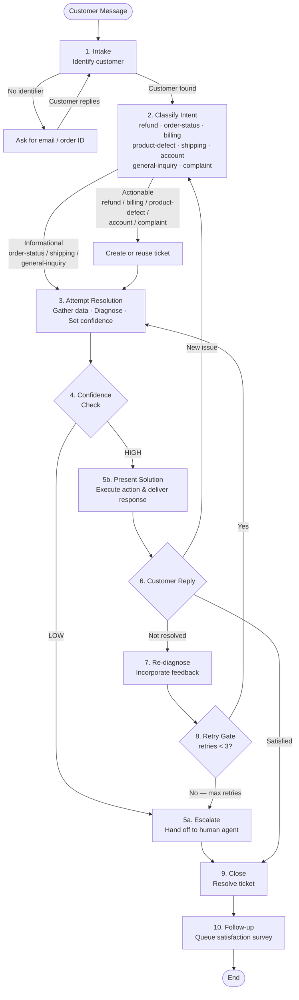

# Agent Skills Demo: Customer Service Agent

A non-trivial customer service agent implemented with [Agent Skills](https://agentskills.io), run in Claude, and powered by two local MCP servers. It demonstrates that Agent Skills can handle complex, multi-step agentic workflows with real business logic, and that those workflows can be tested with automated, multi-turn conversation tests.

## What This Demo Shows

1. **Complex agentic logic in an Agent Skill** — a deterministic 10-step loop with state management, policy-driven decisions, and confidence-based routing.
2. **MCP server integration** — two mock servers (orders + tickets) provide tool APIs that the agent calls autonomously.
3. **Automated multi-turn testing** — a YAML-driven test harness runs conversations through the `claude` CLI and asserts on tool calls, outcomes, and response quality.

## Project Structure

```
.
├── .mcp.json                                   # MCP server configuration
└── .claude/skills/customer-service/
    ├── SKILL.md                                # Skill definition & agentic loop
    ├── mcp/
    │   ├── order_mcp.py                        # Order & customer management API
    │   └── ticket_mcp.py                       # Support ticket system API
    ├── references/
    │   ├── policies.md                         # Refund, escalation & priority policies
    │   └── REFERENCE.md                        # API reference
    ├── assets/
    │   └── response-templates.md               # Response phrasing templates
    └── tests/
        ├── README.md                           # Test harness documentation
        ├── run_test.py                         # Test runner
        └── scenarios/                          # YAML test plans
            ├── order_status_happy.yaml
            ├── refund_auto_approve.yaml
            ├── refund_escalate_high_value.yaml
            ├── escalate_max_retries.yaml
            └── new_issue_mid_conversation.yaml
```

## Prerequisites

- [Claude Code](https://docs.anthropic.com/en/docs/claude-code) installed and authenticated
- Python 3.10+
- [`uv`](https://docs.astral.sh/uv/) (used to run the MCP servers)
- `pyyaml` (`pip install pyyaml`) — required only for running tests

## How It Works

### MCP Servers

Two lightweight [FastMCP](https://github.com/jlowin/fastmcp) servers provide the agent's backend. They start automatically when Claude Code launches (configured in `.mcp.json`).

| Server | Tools | Purpose |
|--------|-------|---------|
| **order-mcp** | `lookup_customer`, `get_order`, `order_history`, `refund`, `reset_state` | Customer & order management |
| **ticket-mcp** | `create_ticket`, `get_ticket`, `update_ticket`, `escalate_ticket`, `list_tickets`, `resolve_ticket`, `reset_state` | Support ticket lifecycle |

Both servers use in-memory mock data (3 customers, 4 orders) that resets between test runs.

### The Agentic Loop

The skill defines a deterministic 10-step loop that Claude follows exactly:

| Step | Name | What Happens |
|------|------|-------------|
| 1 | **Intake** | Identify the customer via email/ID lookup |
| 2 | **Classify Intent** | Categorize the issue; create a ticket if actionable |
| 3 | **Attempt Resolution** | Gather data, diagnose, set confidence level |
| 4 | **Confidence Check** | Route: HIGH → present solution, LOW → escalate |
| 5a | **Escalate** | Hand off to human agent queue |
| 5b | **Present Solution** | Deliver the fix (refund, status info, etc.) |
| 6 | **Customer Reply** | Evaluate satisfaction |
| 7 | **Re-diagnose** | Incorporate new feedback |
| 8 | **Retry Gate** | Allow up to 3 retries before forcing escalation |
| 9 | **Close** | Resolve the ticket |
| 10 | **Follow-up** | Queue a satisfaction survey |

#### Agentic Loop Diagram



### Business Policies

The agent enforces policies defined in [`references/policies.md`](.claude/skills/customer-service/references/policies.md):

- **Refunds**: auto-approved for delivered orders within 30 days up to $150; escalated above $150; defective products auto-approved up to $200
- **Escalation triggers**: customer requests human, high-value refund, billing dispute, gold-tier dissatisfaction, 3 failed retries
- **Priority assignment**: gold-tier and high-value orders get `high`; defective/safety issues get `urgent`

## Running the Skill

1. Open a terminal in this project directory and start Claude Code:

   ```bash
   claude
   ```

2. Invoke the skill with `/customer-service` or just describe a customer support scenario:

   ```
   /customer-service I'm Bob Martinez (bob.m@example.com). Where is my monitor?
   ```

3. **Authorize MCP tool access** — on the first run, Claude Code will prompt you to approve calls to the `order-mcp` and `ticket-mcp` server tools. You can approve them individually or select "Always allow" to skip the prompts for the rest of the session.

### Sample Prompts

Try these to exercise different paths through the agentic loop:

| Prompt | Expected Behavior |
|--------|-------------------|
| `/customer-service I'm Bob Martinez (bob.m@example.com). Where is my monitor?` | Looks up account, reports order ORD-5003 is processing. No ticket created. |
| `/customer-service I'm Alice (alice@example.com). My wireless headphones are defective, I want a refund.` | Creates ticket, auto-approves refund ($129.99 <= $200 defective threshold), resolves ticket. |
| `/customer-service I'm Alice (alice@example.com). I was double-charged for my keyboard order ORD-5002.` | Creates ticket, immediately escalates (billing dispute trigger). |
| `/customer-service Where is my order?` | Asks for email/order ID first (no identifier provided). |
| `/customer-service I'm Carol Wei (carol.wei@example.com). I'd like a refund for order ORD-5004.` | Checks eligibility: $79.99 delivered within 30 days → auto-approves refund. |

### Mock Customers

| ID | Name | Email | Tier |
|----|------|-------|------|
| C-1001 | Alice Johnson | alice@example.com | Gold |
| C-1002 | Bob Martinez | bob.m@example.com | Silver |
| C-1003 | Carol Wei | carol.wei@example.com | Standard |

### Mock Orders

| Order ID | Customer | Item | Total | Status |
|----------|----------|------|-------|--------|
| ORD-5001 | Alice | Wireless Headphones | $129.99 | Delivered |
| ORD-5002 | Alice | Keyboard + Mat | $259.98 | Shipped |
| ORD-5003 | Bob | 27" 4K Monitor | $349.50 | Processing |
| ORD-5004 | Carol | USB Charger + Cables | $79.99 | Delivered |

## Running Tests

The test harness sends multi-turn conversations through the `claude` CLI and validates results with three assertion layers:

1. **Tool-call patterns** — regex matching on MCP tool invocations
2. **Outcome checks** — boolean/string assertions on the transcript (e.g., `escalated: true`)
3. **Quality checks** — LLM-as-judge evaluation (e.g., "Agent greeted customer by first name")

### Commands

```bash
cd .claude/skills/customer-service/tests

# Run a single scenario
python run_test.py scenarios/order_status_happy.yaml \
  --skill-dir ..

# Run all scenarios
python run_test.py scenarios/ \
  -d ..

# Verbose output with JSON report
python run_test.py scenarios/ \
  -d .. \
  --verbose \
  --json-report results.json

# Pass extra flags to claude (e.g., model selection, turn limit)
python run_test.py scenarios/escalate_max_retries.yaml \
  -d .. \
  --extra-flags --model sonnet --max-turns 20
```

### Test Scenarios

| Scenario | File | What It Tests |
|----------|------|--------------|
| Happy path order status | `order_status_happy.yaml` | Simple lookup, no ticket, customer satisfied |
| Auto-approved refund | `refund_auto_approve.yaml` | Defective product refund within policy limits |
| High-value escalation | `refund_escalate_high_value.yaml` | Billing dispute triggers immediate escalation |
| Max-retry escalation | `escalate_max_retries.yaml` | 3 failed retries force escalation |
| Mid-conversation topic change | `new_issue_mid_conversation.yaml` | Agent resets state for a new issue |

### Writing New Tests

Test plans are YAML files. See the [test harness README](.claude/skills/customer-service/tests/README.md) for the full format. Here's the structure:

```yaml
name: my-test
description: What this test verifies.

turns:
  - role: customer
    message: "Hi, I need help with..."
  - role: await_agent
  - role: customer
    message: "Thanks, that works!"

expected_tool_calls:
  must_include:
    - pattern: "mcp__order-mcp__lookup_customer.*email=alice@example\\.com"
  must_not_include:
    - pattern: "mcp__order-mcp__refund"

expected_outcomes:
  customer_identified: "C-1001"
  escalated: false

quality_checks:
  - "Agent greeted the customer by first name"
  - "Agent explained the resolution clearly"
```
